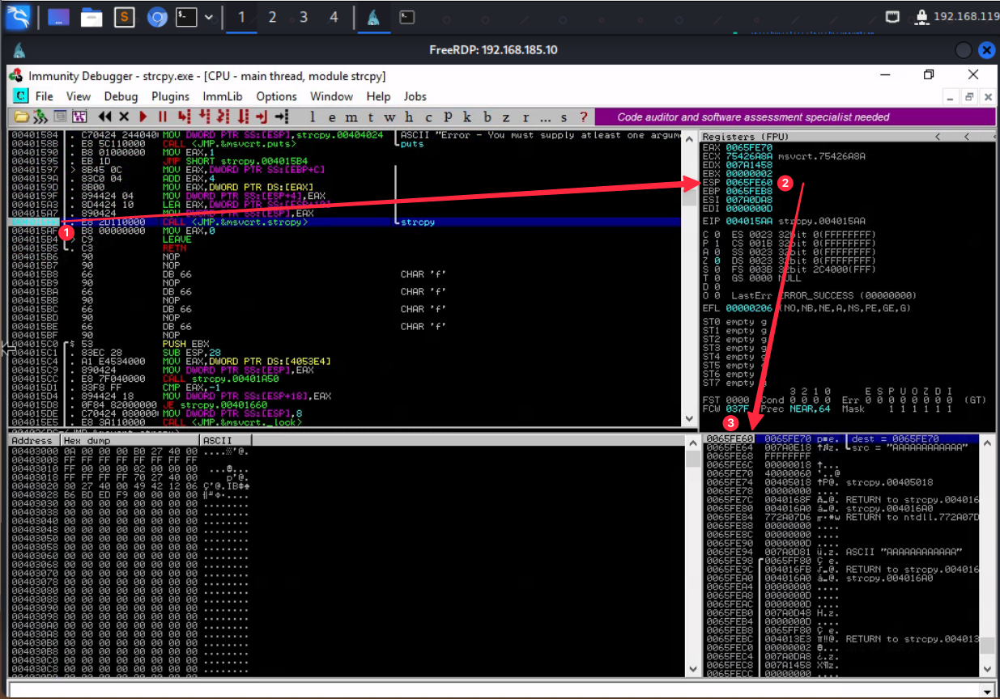
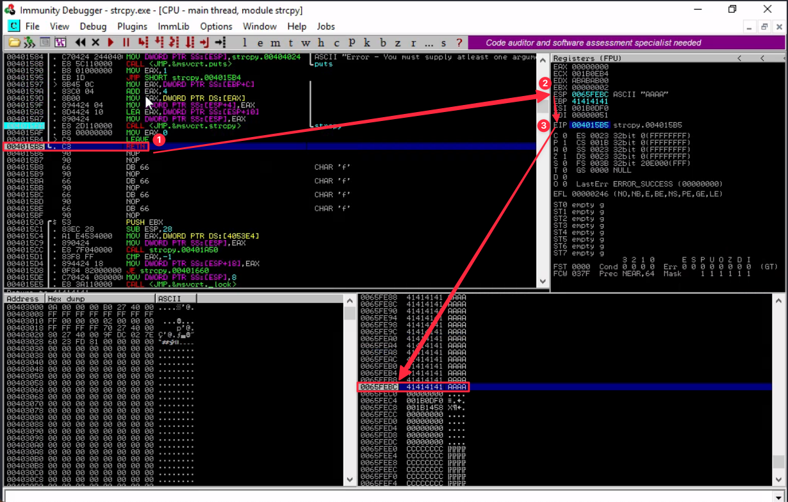
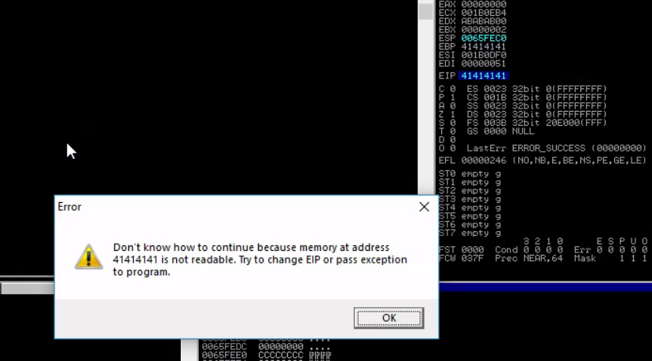

***log into Win10 Client with xfreeRDP***: 
```xfreerdp /u:offsec /p:lab /v:{IP} /cert:ignore```

##### Exercise 1
***Q***: Repeat the steps shown in this section to see the 12 A's copied onto the stack.
***A***: Set breakpoint on strcopy func after loading program with 12 A's as args.


##### Exercise 2
***Q***: 1.  Supply at least 80 A's and verify that EIP after the _strcpy_ will contain the value 41414141.
***A***: Execute the program with 80 A's, find the entry point with 'find referenced strings', set breakpoint on strcopy func, step over func, execute until RETN line is highlighted. ESP is pointing to a location overwritten by A's, this will be popped into EIP and cause a crash because it will redirect execution to an invalid memory address



##### Exercise 3
***Q***: overflow the buffer of the bof-101 binary and cause a segmentation fault (you do not need to exploit this overflow)
***A***: by catting the source code, the buffer was identified to be 80 chars large, use python to generate a 100 char buffer crashes the program and returns the flag

##### Exercise 4
***Q***: find the flag inside _navigating-code.exe_
***A***: 