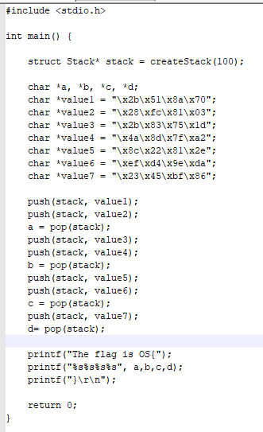

***log into Win10 Client with xfreeRDP***: 
```bash
xfreerdp /u:offsec /p:lab /v:{IP} /cert:ignore
```

##### Exercise 1
***Q***: Repeat the steps shown in this section to see the 12 A's copied onto the stack.
***A***: Set breakpoint on strcopy func after loading program with 12 A's as args.


##### Exercise 2
***Q***: 1.  Supply at least 80 A's and verify that EIP after the _strcpy_ will contain the value 41414141.
***A***: Execute the program with 80 A's, find the entry point with 'find referenced strings', set breakpoint on strcopy func, step over func, execute until RETN line is highlighted. ESP is pointing to a location overwritten by A's, this will be popped into EIP and cause a crash because it will redirect execution to an invalid memory address


##### Exercise 3
***Q***: overflow the buffer of the bof-101 binary and cause a segmentation fault (you do not need to exploit this overflow)
***A***: by catting the source code, the buffer was identified to be 80 chars large, use python to generate a 100 char buffer crashes the program and returns the flag

##### Exercise 4
***Q***: find the flag inside _navigating-code.exe_
***A***: use scp to pull exe down to local machine, use strings and grep for flag.

##### Exercise 5
***Q.1***: Which register allows a function to keep track of required arguments, local variables, and the return address?
***A***: EBP -> base pointer
***Q.2***: Which register is a general purpose register that is often used to store the results of logical instructions?
***A***: EAX
***Q.3***: Which register controls the execution flow of the program by storing the address of the next instruction to be executed?
***A***: EIP -> instruction pointer
***Q.4***: Which register stores the lowest memory address (top) of the stack and is dynamic based on how much memory a function needs to store data, arguments, and pointers?
***A***: ESP -> stack pointer

##### Exercise 6
***Q***: look at the code below and determine the flag value

***A***: Only the most recently pushed value can be popped from the stack on each pop call. This makes the final sequence of variables -> 
a= value2 == \x28\xfc\x81\x03
- where 1 remains on the bottom of the stack
b= value4 == \x4a\x8d\x7f\xa2
- where the stack now also has value 3 on it
c= value6 == \xef\xd4\x9e\xda
- where the stack is now 1,3,5 after popping 6 from it
d= 7 == \x23\x45\xbf\x86


